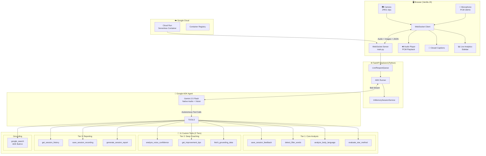

# 🎯 InterviewAce — Real-Time AI Interview Coach

> **Gemini Live Agent Challenge** | Category: **Live Agents 🗣️**
>
> 🔗 **[Live Demo](https://interviewace-117780891544.us-central1.run.app/)** · 📹 **[Demo Video](#)** · 🏗️ **[Architecture](#-architecture)**

---

## 💡 The Problem

Practicing for technical interviews is one of the most stressful parts of a job search:
- **Real mock interviews cost $150–300/session** — inaccessible for most candidates
- Candidates make the same mistakes repeatedly — **filler words, bad posture, unstructured answers** — without ever knowing it
- Existing AI chatbots are **text-only**, missing the critical non-verbal dimensions that real interviewers evaluate

## 🚀 The Solution

**InterviewAce** is a real-time, multimodal AI interview coach that replicates a genuine **Google Meet-style** technical interview. A live AI hiring manager ("Coach Ace") **sees** your body language through the camera, **hears** your filler words through the microphone, and **speaks** to you naturally through native voice — all powered by the **Gemini Live API** and **Google ADK**.

> **No text boxes. No typing. Just a real conversation with an AI that actually watches and listens.**

---

## ✨ Key Features

| Feature | How It Works |
|---------|-------------|
| 🗣️ **Native Audio Voice** | Real-time bidirectional audio via Gemini 2.5 Flash Native Audio. Sub-500ms latency. Supports natural interruptions and barge-in. |
| 👀 **Live Camera Vision** | Webcam frames streamed at 1 fps to Gemini's vision model for real-time body language analysis (posture, eye contact, expression). |
| 📊 **11 ADK Background Tools** | Silent analysis tools fire automatically during the interview — filler word detection, STAR method evaluation, voice confidence, and more. |
| 🔍 **Google Search Grounding** | ADK's built-in `google_search` tool prevents hallucination of company interview facts. |
| 🏢 **Company-Specific Styles** | Google, Amazon (Leadership Principles), Meta, and Apple interview question frameworks. |
| 📝 **Session Report & Transcript** | Full performance breakdown with downloadable transcript after every session. |
| 🎨 **Google Meet Replica UI** | Pixel-perfect Meet interface with closed captions, volume visualizers, participant panel, chat sidebar, and session timer. |

---

## 🏗️ Architecture

InterviewAce follows the official **ADK bidirectional streaming pattern** (`LiveRequestQueue`) for real-time voice + vision interaction.



### Data Flow

```
1. User speaks → Mic captures PCM audio → WebSocket → FastAPI → LiveRequestQueue → Gemini Live API
2. User's camera → JPEG frame (1 fps) → WebSocket → FastAPI → LiveRequestQueue → Gemini Vision
3. Gemini responds → Native audio bytes → WebSocket → Browser AudioPlayer → User hears voice
4. Gemini calls tools → ADK executes silently → Results update sidebar analytics in real-time
5. Gemini transcribes → Input/Output transcription → Closed Captions rendered in UI
```

---

## 🔧 How the Agent Works

### The Agent: Coach Ace

Coach Ace is a single **ADK `Agent`** with a carefully engineered persona — a senior hiring manager with 15 years at Google, Meta, Amazon, and Apple. The agent:

1. **Greets the candidate** naturally when they join the meeting
2. **Generates dynamic interview questions** based on the selected role, company style, and difficulty level
3. **Listens to answers** and provides natural, human-like follow-ups ("Okay, and what was the actual outcome there?")
4. **Silently analyzes** the candidate every 2-3 answers using background tool calls:
   - `save_session_feedback` — Scores confidence, clarity, content, body language (0-100)
   - `detect_filler_words` — Counts "um", "uh", "like", "you know", etc.
   - `analyze_body_language` — Rates posture, eye contact, expression from camera frames
   - `evaluate_star_method` — Checks if the answer followed Situation-Task-Action-Result structure
5. **Generates a comprehensive session report** when the interview ends

### Tool Tier Architecture

| Tier | Tools | Purpose |
|------|-------|---------|
| **Tier 1** | `save_session_feedback`, `detect_filler_words`, `analyze_body_language`, `evaluate_star_method` | Core real-time analysis — fires every 2-3 answers |
| **Tier 2** | `analyze_voice_confidence`, `get_improvement_tips`, `fetch_grounding_data` | Deeper coaching — voice pace/volume analysis, targeted tips, verified knowledge base |
| **Tier 3** | `get_session_history`, `save_session_recording`, `generate_session_report` | Session management and comprehensive reporting |
| **Grounding** | `google_search` (ADK built-in) | Prevents hallucination of company-specific interview facts |

### Grounding & Anti-Hallucination

InterviewAce uses **two grounding mechanisms**:
1. **`fetch_grounding_data`** — Returns verified interview coaching knowledge from a curated local database (`grounding_data.py`) covering STAR method, body language tips, voice delivery, and common mistakes
2. **`google_search`** (ADK built-in) — When the candidate asks about a specific company's interview process, the agent searches for real, current information rather than guessing

---

## 🎨 UI Features

The frontend is a **pixel-perfect Google Meet replica** built entirely with vanilla JavaScript:

- **3 Video Tiles** — Coach Ace (AI interviewer), Elena (AI notetaker), You (with live webcam feed)
- **Volume Visualizer Rings** — Animated concentric rings pulse in real-time when audio is detected
- **Equalizer Bars** — 3-bar equalizer animation replaces the mic icon when speaking
- **Closed Captions** — Real-time CC powered by Gemini's input/output transcription
- **Live Analytics Sidebar** — Confidence, Clarity, STAR Score, Body Language bars update in real-time
- **Filler Word Counter** — Running count with detected words and coaching tips
- **Body Language Indicators** — Eye contact, posture, expression ratings with color-coded dots
- **STAR Method Badges** — S, T, A, R badges light up green as you hit each component
- **Session Timer** — MM:SS elapsed time counter during active interviews
- **Chat Sidebar** — In-call messaging panel (Google Meet style)
- **People Panel** — Shows all 3 participants with mic status
- **Meeting Details** — Coupable meeting link and session parameters
- **Toast Notifications** — Contextual notifications for mic/camera/CC toggles
- **Feedback Modal** — Full score breakdown with performance tier and downloadable transcript

---

## 💻 Getting Started

### Prerequisites
- Python 3.10+
- A [Google API Key](https://aistudio.google.com/app/apikey) with Gemini access

### Installation

```bash
# Clone the repository
git clone https://github.com/SameerAliKhan-git/IntyerviewBit.git
cd IntyerviewBit/interviewace

# Create virtual environment
python -m venv venv

# Activate (Windows)
.\venv\Scripts\activate
# Activate (Mac/Linux)
source venv/bin/activate

# Install dependencies
pip install -r requirements.txt
```

### Environment Variables

Create a `.env` file in the `interviewace/` directory:

```env
GOOGLE_API_KEY=your_gemini_api_key_here
```

### Run Locally

```bash
python app/main.py
```

Open **http://localhost:8080** in your browser.

### Deploy to Google Cloud Run

```bash
# Build with Cloud Build
gcloud builds submit --tag gcr.io/YOUR_PROJECT_ID/interviewace .

# Deploy
gcloud run deploy interviewace \
  --image gcr.io/YOUR_PROJECT_ID/interviewace \
  --region us-central1 \
  --platform managed \
  --allow-unauthenticated \
  --port 8080 \
  --memory 1Gi \
  --session-affinity \
  --set-env-vars "GOOGLE_API_KEY=YOUR_KEY,GOOGLE_GENAI_USE_VERTEXAI=FALSE"
```

---

## 📁 Project Structure

```
IntyerviewBit/
├── README.md
├── cloudbuild.yaml                    # Google Cloud Build config
└── interviewace/
    ├── Dockerfile                     # Cloud Run container
    ├── .dockerignore
    ├── .env.example
    ├── requirements.txt
    └── app/
        ├── main.py                    # FastAPI + WebSocket server
        ├── interview_coach_agent/
        │   ├── __init__.py
        │   ├── agent.py               # ADK Agent definition (11 tools)
        │   ├── prompts.py             # Agent persona & instructions
        │   ├── tools.py               # All 10 custom tool implementations
        │   └── grounding_data.py      # Verified coaching knowledge base
        └── static/
            ├── index.html             # Single-page app (Google Meet UI)
            ├── favicon.ico
            ├── css/
            │   └── style.css          # Complete Meet-style CSS
            └── js/
                ├── app.js             # Main application logic
                ├── audio-player.js    # PCM audio playback engine
                ├── audio-recorder.js  # Mic capture + PCM encoding
                └── camera.js          # Webcam frame capture (1 fps)
```

---

## 🛠️ Technologies

| Technology | Usage |
|------------|-------|
| **Google ADK** | Agent orchestration, tool execution, LiveRequestQueue |
| **Gemini 2.5 Flash Native Audio** | Real-time voice interaction via Live API |
| **Gemini Vision** | Body language analysis from webcam frames |
| **Google Search** (ADK built-in) | Grounding to prevent hallucination |
| **Google Cloud Run** | Serverless container hosting |
| **FastAPI** | WebSocket server bridging browser ↔ ADK |
| **Uvicorn** | ASGI server with WebSocket support |
| **Vanilla JavaScript** | Frontend UI (no framework dependencies) |
| **Web Audio API** | PCM audio recording and playback |
| **MediaDevices API** | Camera frame capture |

---

## 🏆 Hackathon Criteria Alignment

| Criterion | How InterviewAce Addresses It |
|-----------|-------------------------------|
| **Beyond the text box** | Fully voice-driven. Camera vision. No text input needed at any point. |
| **Live API usage** | Native `bidiGenerateContent` streaming via ADK `LiveRequestQueue` |
| **Multimodal input** | Audio (PCM 16kHz) + Vision (JPEG 1fps) streamed simultaneously |
| **Tool use** | 11 tools across 3 tiers — all called autonomously by the model |
| **Grounding** | `google_search` (ADK built-in) + `fetch_grounding_data` (local KB) |
| **Google Cloud** | Deployed on Cloud Run with Dockerfile + cloudbuild.yaml |
| **User experience** | Pixel-perfect Google Meet replica with real-time analytics |

---

## 👥 Team

Built with ❤️ for the **Gemini Live Agent Challenge** by the InterviewAce team.

---

*Powered by Google ADK · Gemini Live API · Google Cloud Run*
