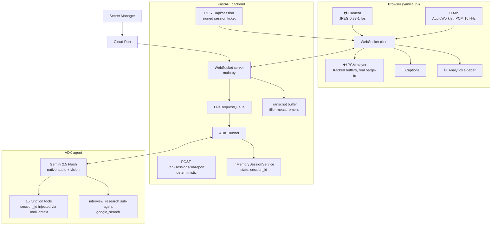

# 🎯 InterviewAce — Real-Time AI Interview Coach

> **Gemini Live Agent Challenge** · Category: **Live Agents 🗣️**
>
> 🔗 **[Live Demo](https://interviewace-117780891544.us-central1.run.app/)** · 🏗️ **[Architecture](#-architecture)** · 🔐 **[Security](SECURITY.md)**

---

## 💡 The Problem

Practicing for technical interviews is one of the most stressful parts of a job search:

- **Mock interviews with a real coach cost $150–300 a session** — out of reach for most candidates
- Candidates repeat the same mistakes — filler words, closed posture, unstructured answers — without ever hearing about them
- Text-based AI chatbots miss the non-verbal dimension entirely

## 🚀 The Solution

**InterviewAce** is a real-time multimodal mock interview. A live AI hiring manager ("Coach Ace")
sees your body language through the camera, hears your delivery through the microphone, and speaks
to you in native voice — powered by the **Gemini Live API** and **Google ADK**.

> No text boxes. No typing. A real spoken conversation, with a scorecard at the end.

---

## ✨ Features

| Feature | How it works |
|---------|--------------|
| 🗣️ **Native audio voice** | Bidirectional PCM audio over the Gemini Live API via ADK's `LiveRequestQueue`. Supports interruption and barge-in. |
| 👀 **Live camera vision** | Webcam frames streamed at an adaptive 0.33–1 fps for body-language observations. Frames stop immediately when you turn the camera off. |
| 📊 **15 coaching tools** | Scoring, STAR evaluation, voice delivery, engagement, emotion, and reporting tools the model calls during the interview. |
| 🔤 **Measured filler words** | Counted server-side from Gemini's real speech transcript — not estimated by the model. |
| 🔍 **Search grounding** | A dedicated research sub-agent uses `google_search` so company facts are looked up rather than guessed. |
| 🏢 **Company styles** | Google, Amazon, Meta, Apple, Microsoft, Netflix question frameworks. |
| 📝 **Deterministic report** | The end-of-session report is computed server-side from recorded state, so it never depends on the model calling a tool in time. |
| 🎨 **Meet-style UI** | Live captions, volume visualizers, analytics sidebar, session timer, downloadable transcript. |

### What is measured vs. judged

Being straight about this matters, because the scorecard looks like measurement:

| Signal | Source |
|--------|--------|
| Filler word count and rate | **Measured** from Gemini's `input_transcription` of your actual speech |
| Session duration, question count, score trends | **Measured** from recorded session state |
| Confidence, clarity, content, STAR, body language, voice, engagement | **Judged by the model** — a consistent rubric applied to a subjective read, not a physical measurement |

---

## 🏗️ Architecture


```mermaid
graph TB
    subgraph "Browser (vanilla JS)"
        MIC[🎤 Mic<br/>AudioWorklet, PCM 16 kHz] --> WS
        CAM[📷 Camera<br/>JPEG 0.33-1 fps] --> WS
        WS[WebSocket client] --> PLAYER[🔊 PCM player<br/>tracked buffers, real barge-in]
        WS --> CC[💬 Captions]
        WS --> ANALYTICS[📊 Analytics sidebar]
    end

    subgraph "FastAPI backend"
        TICKET[POST /api/session<br/>signed session ticket]
        BACKEND[WebSocket server<br/>main.py]
        REPORT[POST /api/sessions/:id/report<br/>deterministic]
        BACKEND --> LRQ[LiveRequestQueue]
        BACKEND --> TRANSCRIPT[Transcript buffer<br/>filler measurement]
        LRQ --> RUNNER[ADK Runner]
        RUNNER --> SESSION[InMemorySessionService<br/>state: session_id]
    end

    subgraph "ADK agent"
        RUNNER <--> GEMINI[Gemini 2.5 Flash<br/>native audio + vision]
        GEMINI --> TOOLS[15 function tools<br/>session_id injected via ToolContext]
        GEMINI --> RESEARCH[interview_research sub-agent<br/>google_search]
    end

    WS <--> BACKEND
    TICKET --> WS
    CR[Cloud Run] --> BACKEND
    SM[Secret Manager] --> CR
```

### Data flow

```
1. Browser requests a session  -> server mints a random id + HMAC-signed token
2. Mic PCM  -> WebSocket -> LiveRequestQueue -> Gemini Live API
3. Camera JPEG -> WebSocket -> LiveRequestQueue -> Gemini vision
4. Gemini audio -> WebSocket -> browser AudioPlayer (buffers tracked, so barge-in cuts them)
5. Gemini input_transcription -> server transcript buffer -> filler-word measurement
6. Gemini tool calls -> ADK executes -> results pushed to the owning session's socket only
7. End of interview -> POST /report -> report computed from recorded state
```

### Session identity and isolation

Session ids are generated **server-side** (`secrets.token_urlsafe`) and returned with an
HMAC-signed token. Every analytics read must present that token. Inside the agent, tools
receive their `session_id` from ADK's `ToolContext` — it is never a model-supplied argument,
and a tool call that cannot resolve a session records nothing rather than falling back to
another active session.

---

## 💻 Getting started

### Prerequisites

- Python 3.10+
- A [Google API key](https://aistudio.google.com/app/apikey) with Gemini access

### Install and run

```bash
git clone https://github.com/SameerAliKhan-git/IntyerviewBit.git
cd IntyerviewBit/interviewace

python -m venv venv
source venv/bin/activate        # Windows: .\venv\Scripts\activate

pip install -r requirements.txt

cp .env.example .env            # then add your GOOGLE_API_KEY

uvicorn app.main:app --reload --port 8080
```

Open **http://localhost:8080** and grant camera and microphone permission.

> Run from the `interviewace/` directory using `app.main:app`. That is the canonical import
> path; importing from inside `app/` can load modules twice with split session state.

### Configuration

All variables are documented in [.env.example](interviewace/.env.example). The ones that matter:

| Variable | Purpose |
|----------|---------|
| `GOOGLE_API_KEY` | **Required.** Gemini API key. A free-tier AI Studio key works — no billing account needed. |
| `SESSION_SECRET` | Signs session tokens. Set this in any multi-instance deployment. |
| `MAX_SESSION_SECONDS` | Hard cap per interview (default 600). |
| `MAX_CONCURRENT_SESSIONS`, `MAX_SESSIONS_PER_IP`, `NEW_SESSIONS_PER_IP_PER_HOUR` | Quota and abuse caps. Defaults are sized for the free tier; raise them on a paid quota. |
| `ENABLE_DEBUG_ENDPOINT` | Exposes `/debug`. Leave off in production. |
| `ENABLE_SEARCH_GROUNDING` | Set `false` to drop the search sub-agent. |

### Tests

```bash
cd interviewace
pytest -q
ruff check .
```

The suite stubs the ADK, so it runs without `google-adk` installed. It does **not** exercise the
real Live API — verify that manually against a live key before deploying.

---

## ☁️ Deploy to Cloud Run

> **Cloud Run requires a billing account on the project**, even to use its free tier. If
> you are running on a free-tier API key with no billing set up, running locally is your
> zero-cost path — the app needs no GPU and no paid infrastructure. Free hosts that
> support long-lived WebSockets (Hugging Face Spaces, Render, Fly.io) also work, since the
> server is only a proxy to the Gemini API.

Secrets go in Secret Manager, never in `--set-env-vars`.

```bash
# One-time setup
printf '%s' "YOUR_GEMINI_API_KEY" | gcloud secrets create interviewace-api-key --data-file=-
python -c "import secrets;print(secrets.token_urlsafe(48))" | \
  gcloud secrets create interviewace-session-secret --data-file=-

# Build and deploy
PROJECT_ID=your-project ./interviewace/deploy/deploy.sh
```

Or with Terraform (Cloud Run, service account, Secret Manager, optional budget alert):

```bash
cd interviewace/deploy/terraform
terraform init
terraform apply -var="project_id=YOUR_PROJECT" -var="image=gcr.io/YOUR_PROJECT/interviewace:latest"
```

> ⚠️ The deployment is public and anonymous, so anyone who reaches it consumes your key's
> quota. On a free-tier key that means 429s, not a bill. **If your project has billing
> enabled, set a GCP budget alert** before going public. See [SECURITY.md](SECURITY.md).

---

## 📁 Project structure

```
IntyerviewBit/
├── README.md
├── SECURITY.md
├── cloudbuild.yaml                  # Cloud Build -> Cloud Run, secrets from Secret Manager
├── .github/workflows/ci.yml         # lint, tests, secret scan, docker build
└── interviewace/
    ├── Dockerfile
    ├── requirements.txt
    ├── pyproject.toml
    ├── .env.example
    ├── ARCHITECTURE.md
    ├── test_interviewace.py         # tool and session-isolation tests
    ├── test_adk_events.py           # HTTP, auth, rate limit, WebSocket tests
    ├── deploy/
    │   ├── deploy.sh
    │   └── terraform/
    └── app/
        ├── __init__.py
        ├── main.py                  # FastAPI, WebSocket bridge, auth, rate limits
        ├── runtime_config.py        # model profiles, input validation, limits
        ├── ws_manager.py            # strict session -> socket routing
        ├── interview_coach_agent/
        │   ├── agent.py             # ADK agent + google_search sub-agent
        │   ├── prompts.py
        │   ├── tools.py             # 15 tools, ToolContext-bound
        │   └── grounding_data.py
        └── static/
            ├── index.html
            ├── css/style.css
            └── js/
                ├── app.js
                ├── audio-player.js
                ├── audio-recorder.js
                ├── camera.js
                ├── dashboard.js
                └── pcm-recorder-processor.js
```

---

## 🛠️ Technologies

| Technology | Usage |
|------------|-------|
| **Google ADK** 1.27 | Agent orchestration, tools, `LiveRequestQueue`, `run_live()` |
| **Gemini 2.5 Flash native audio** | Real-time voice via the Live API |
| **Gemini vision** | Body-language observation from webcam frames |
| **Google Search** (ADK built-in) | Grounding, via a dedicated research sub-agent |
| **Cloud Run + Secret Manager** | Serverless hosting and secret storage |
| **FastAPI / Uvicorn** | WebSocket server bridging browser ↔ ADK |
| **Vanilla JavaScript** | Frontend, no framework |
| **Web Audio API (AudioWorklet)** | Off-main-thread PCM capture and playback |

### Data handling

Audio and video are streamed to Google's Gemini API for live analysis and are **not recorded**
by this application. Scores and transcripts live in the memory of the instance serving your
session and are discarded when it expires. Nothing is written to disk or to a database.

---

## 👥 Built by

Built for the **Gemini Live Agent Challenge** by Sameer.

*Powered by Google ADK · Gemini Live API · Google Cloud Run*
