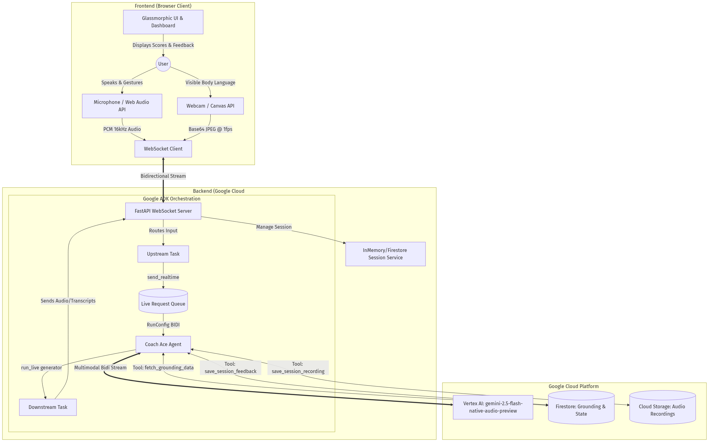

# 🏗️ InterviewAce Architecture Specification

**InterviewAce** is a real-time, low-latency, bidirectional streaming application built specifically for the **Gemini Live Agent** track. It bridges a custom glassmorphic frontend with the **Google Agent Development Kit (ADK)** and the Gemini Live API.

## 📊 1. System Architecture Diagram



*(Note: If your viewer supports Mermaid, the source diagram is below)*
```mermaid
graph TD
    subgraph "Frontend (Browser Client)"
        UI[Glassmorphic UI & Dashboard]
        Mic[Microphone / Web Audio API]
        Cam[Webcam / Canvas API]
        
        UI --> |Displays Scores & Feedback| User((User))
        User --> |Speaks & Gestures| Mic
        User --> |Visible Body Language| Cam
        
        Mic --> |PCM 16kHz Audio| WS_Client[WebSocket Client]
        Cam --> |Base64 JPEG @ 1fps| WS_Client
    end

    subgraph "Backend (Google Cloud Run)"
        WS_Server[FastAPI WebSocket Server]
        WS_Client <==> |Bidirectional Stream| WS_Server
        
        Session[InMemory/Firestore Session Service]
        WS_Server --> |Manage Session| Session
        
        subgraph "Google ADK Orchestration"
            Upstream[Upstream Task]
            Downstream[Downstream Task]
            Queue[(Live Request Queue)]
            Agent[Coach Ace Agent]
            
            WS_Server --> |Routes Input| Upstream
            Upstream --> |send_realtime()| Queue
            Queue --> |RunConfig (StreamingMode.BIDI)| Agent
            Agent --> |run_live() generator| Downstream
            Downstream --> |Sends Audio/Transcripts| WS_Server
        end
    end

    subgraph "Google Cloud Platform Services"
        Gemini[Vertex AI: gemini-2.5-flash-native-audio-preview]
        Firestore[(Firestore: Grounding & State)]
        GCS[(Cloud Storage: Audio Recordings)]
        
        Agent <==> |Multimodal Bidi Stream| Gemini
        Agent <--> |Tool: fetch_grounding_data| Firestore
        Agent <--> |Tool: save_session_feedback| Firestore
        Agent <--> |Tool: save_session_recording| GCS
    end
```

## ⚙️ 2. Core Components & Working Mechanism

### 2.1 The Visual & Audio Intake (Frontend)
To meet the "Multimodal Interactions" requirement, the frontend does not rely on text inputs:
- **Audio Capture (`audio-recorder.js`):** Uses the Web Audio API and an `AudioWorkletNode` (`pcm-recorder-processor.js`) to capture raw audio from the microphone. It converts the Float32 arrays into 16-bit Int16 PCM data, which is sent as raw binary payloads via WebSockets directly to the backend.
- **Vision Capture (`camera.js`):** Accesses the user webcam. Once per second (`1fps`), it draws the current video frame to a hidden Canvas, encodes it to a lightweight `image/jpeg` base64 string, and pushes it over the WebSocket.

### 2.2 The Bidirectional Orchestrator (`main.py`)
This is the FastAPI backend that manages the complex timing required for live, interruptible streaming.
1. When a browser connects, `main.py` opens a persistent WebSocket.
2. It initializes the **Google ADK** `LiveRequestQueue`.
3. It spawns **two concurrent asynchronous tasks**:
   - **`upstream_task`**: Listens to the WebSocket. When it receives raw binary PCM data, it packs it into a `types.Blob(mime_type="audio/pcm;rate=16000")` and pushes it into the ADK queue. When it receives video frames, it pushes them as image blobs.
   - **`downstream_task`**: Iterates over the ADK `runner.run_live()` async generator. When the Gemini model replies with an audio response (as `inline_data`), it extracts the audio, encodes it, and sends it down the WebSocket to the browser for playback.

### 2.3 The Agent Brain (`agent.py` & `tools.py`)
The system uses the `google.adk.agents.llm_agent.Agent` class.
- **Model Engine:** Powered by `gemini-2.5-flash-native-audio-preview` which natively supports audio-in and audio-out (`response_modalities=["AUDIO"]`), satisfying the Hackathon constraint.
- **Interruption Handling:** Because the ADK uses bidirectional queues, if the user speaks while the AI is replying, the Gemini API automatically detects the speech, interrupts its current generation thread, drops the audio buffer, and listens to the new input. This fulfills the "Talk naturally & can be interrupted" criteria.

### 2.4 Cloud Persistence (Hackathon GCP Requirement)
To meet the requirement of using at least one Google Cloud Service, the agent uses integrated Python tools to communicate with GCP infrastructure (defined in Terraform):
1. **Firestore:** Stores interview session state, tracks long-term score improvements, and stores the grounding data/rubrics (e.g., STAR method constraints).
2. **Cloud Storage:** At the end of a session, a generated JSON report and recording metadata are saved into a specific GCS bucket via the `save_session_recording` tool.
3. **Cloud Run:** The FastAPI application is containerized and designed for stateless scaling horizontally behind Cloud Run (`min_instance_count = 0, max_instance_count = 5`).

## 🛡️ 3. Verification of Devpost SRS Constraints

| Constraint | InterviewAce Implementation |
| :--- | :--- |
| **Category:** Live Agents (`Audio/Vision`) | Fully implemented. Uses real-time 16kHz PCM audio streaming + 1fps video frames. |
| **Natural Interruption Handling** | Yes. Fully supported via `RunConfig(streaming_mode=StreamingMode.BIDI)`. |
| **Tech:** Google ADK or GenAI SDK | Yes. Entirely orchestrated by `google-adk` version 0.6+. |
| **Backend:** Google Cloud Services | Yes. Deployable to Cloud Run + Firestore + Cloud Storage. |
| **Audio Output** | Yes. Model configured with `response_modalities=["AUDIO"]`, emitting raw voice buffers directly to frontend speakers. |
