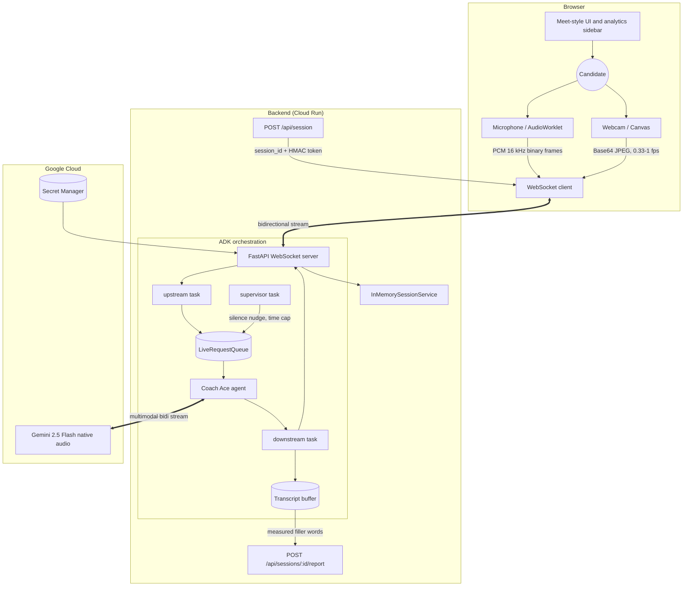

# 🏗️ InterviewAce Architecture

InterviewAce is a low-latency bidirectional streaming application that bridges a browser
client to the Gemini Live API through the **Google Agent Development Kit (ADK)**.

## 1. System diagram

```mermaid
graph TD
    subgraph Browser
        UI[Meet-style UI and analytics sidebar]
        Mic[Microphone / AudioWorklet]
        Cam[Webcam / Canvas]

        UI --> User((Candidate))
        User --> Mic
        User --> Cam

        Mic --> |PCM 16 kHz binary frames| WS_Client[WebSocket client]
        Cam --> |Base64 JPEG, 0.33-1 fps| WS_Client
    end

    subgraph "Backend (Cloud Run)"
        Ticket[POST /api/session]
        WS_Server[FastAPI WebSocket server]
        Report[POST /api/sessions/:id/report]
        Session[InMemorySessionService]

        Ticket --> |session_id + HMAC token| WS_Client
        WS_Client <==> |bidirectional stream| WS_Server
        WS_Server --> Session

        subgraph "ADK orchestration"
            Upstream[upstream task]
            Downstream[downstream task]
            Supervisor[supervisor task]
            Queue[(LiveRequestQueue)]
            Agent[Coach Ace agent]

            WS_Server --> Upstream
            Upstream --> Queue
            Queue --> Agent
            Agent --> Downstream
            Downstream --> WS_Server
            Downstream --> Transcript[(Transcript buffer)]
            Supervisor --> |silence nudge, time cap| Queue
        end

        Transcript --> |measured filler words| Report
    end

    subgraph "Google Cloud"
        Gemini[Gemini 2.5 Flash native audio]
        Secrets[(Secret Manager)]

        Agent <==> |multimodal bidi stream| Gemini
        Secrets --> WS_Server
    end
```

## 2. Components

### 2.1 Capture (browser)

- **`audio-recorder.js`** captures the microphone through an **AudioWorklet**
  (`pcm-recorder-processor.js`), which runs off the main thread. Blocks are accumulated to
  2048 frames (~128 ms at 16 kHz) before being posted, converted to Int16 PCM, and sent as
  binary WebSocket frames. A `ScriptProcessorNode` path remains only as a fallback for
  browsers without AudioWorklet.
- **`camera.js`** draws the video element to an offscreen canvas and emits a base64 JPEG at
  an adaptive 0.33–1 fps. Turning the camera off stops the capture timer, so no frames are
  sent — disabling the track alone would still upload black frames.
- **`audio-player.js`** schedules incoming 24 kHz PCM through `AudioBufferSourceNode`s and
  **tracks every scheduled node**, so an interruption can stop buffers that are already
  queued. Resetting only the scheduling cursor would let the agent keep talking over the
  candidate for the length of the buffer.

### 2.2 Orchestration (`main.py`)

On connect, the server validates the session token, refuses a duplicate connection for a
session that is already live, normalizes every query parameter against an allowlist, and
creates the ADK session with `state={"session_id": ...}`. It then runs three tasks:

- **`upstream_task`** — reads the socket. Binary frames become
  `types.Blob(mime_type="audio/pcm;rate=16000")`; JSON `image` payloads are base64-validated
  and MIME-checked before becoming image blobs.
- **`downstream_task`** — iterates `runner.run_live()`, records every `input_transcription`
  chunk into the session's transcript buffer, and forwards the event to the browser.
- **`supervisor_task`** — enforces `MAX_SESSION_SECONDS` and injects a silence nudge. The
  model cannot perceive elapsed silence, so this signal is supplied externally rather than
  asked for in the prompt.

The opening prompt is sent once per session, immediately. It is not gated on the first
model event, and it is not re-sent on reconnect.

### 2.3 The agent (`agent.py`, `tools.py`)

Coach Ace is an ADK `Agent` with 15 function tools. `google_search` lives on a separate
`interview_research` sub-agent exposed through `AgentTool`, because ADK permits only one
built-in tool per agent and does not allow mixing it with function tools.

**Session binding.** Every stateful tool takes `tool_context: ToolContext` as its first
parameter and resolves `session_id` from `tool_context.state`. The model never supplies a
session id, so it cannot invent one. A tool that cannot resolve a session returns an error
and records nothing — it never falls back to another active session, which would write one
candidate's analytics into another's dashboard.

**Interruption.** `RunConfig(streaming_mode=StreamingMode.BIDI)` lets the Live API detect
speech and interrupt generation. The client completes the behaviour by stopping already
buffered audio when it sees an `interrupted` event.

### 2.4 State and persistence

All session state is **in-process**: analytics, transcripts, and reports live in module-level
dicts in `tools.py`, bounded by a one-hour idle TTL and a 500-session cap. Nothing is written
to disk, Firestore, or Cloud Storage.

The consequences are deliberate and worth stating plainly:

- An instance restart loses in-flight sessions.
- Cloud Run runs with `session_affinity = true` so analytics reads reach the instance that
  owns the session.
- Cross-session progress comparison only covers sessions served by the same live instance;
  the browser also keeps a single previous-session snapshot in `localStorage`.

Moving to Firestore would remove those limits and is the natural next step, but it is not
implemented today.

### 2.5 Security posture

| Control | Implementation |
|---------|----------------|
| Session identity | Server-generated `secrets.token_urlsafe(24)` + HMAC-SHA256 token |
| Analytics authorization | Token verified on every `/api/sessions/*` read |
| Transport hardening | CSP with `script-src 'self'`, HSTS, `X-Frame-Options`, `nosniff` |
| XSS | All model- and user-derived strings escaped; chat built from DOM nodes |
| Abuse and cost | Per-IP hourly and concurrent caps, global cap, hard session duration cap |
| Secrets | Secret Manager via `--set-secrets`; `/debug` gated and key-free |

See [SECURITY.md](../SECURITY.md) for operational guidance.

## 3. Live Agents category alignment

| Requirement | Implementation |
|-------------|----------------|
| Audio + vision live agent | 16 kHz PCM audio and 0.33–1 fps JPEG frames, streamed simultaneously |
| Natural interruption | `StreamingMode.BIDI` server-side, tracked-buffer cancellation client-side |
| Google ADK | `google-adk` 1.27, `LiveRequestQueue`, `runner.run_live()`, `ToolContext`, `AgentTool` |
| Google Cloud | Cloud Run, Secret Manager, Cloud Build (Terraform provided) |
| Audio output | `response_modalities=["AUDIO"]` with model-aware fallback to text |
| Grounding | `google_search` research sub-agent plus a curated local knowledge base |
